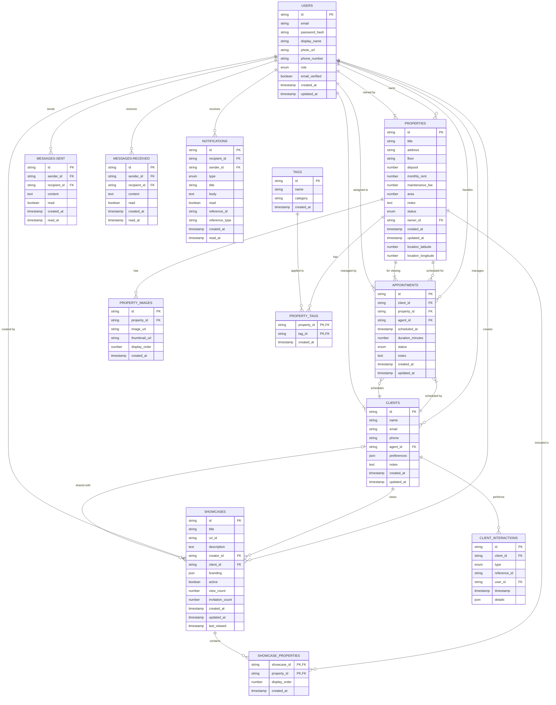

```mermaid
erDiagram
    USERS ||--o{ PROPERTIES : owns
    USERS ||--o{ CLIENTS : manages
    USERS ||--o{ SHOWCASES : creates
    USERS ||--o{ APPOINTMENTS : handles
    USERS ||--o{ MESSAGES-SENT : sends
    USERS ||--o{ MESSAGES-RECEIVED : receives
    USERS ||--o{ NOTIFICATIONS : receives

    PROPERTIES ||--o{ PROPERTY_IMAGES : has
    PROPERTIES ||--o{ SHOWCASE_PROPERTIES : "included in"
    PROPERTIES ||--o{ APPOINTMENTS : "scheduled for"
    PROPERTIES }|--|| USERS : "owned by"

    PROPERTIES ||--o{ PROPERTY_TAGS : "has"
    TAGS ||--o{ PROPERTY_TAGS : "applied to"

    CLIENTS ||--o{ APPOINTMENTS : schedules
    CLIENTS ||--o{ CLIENT_INTERACTIONS : performs
    CLIENTS ||--o{ SHOWCASES : views
    CLIENTS }|--|| USERS : "managed by"

    SHOWCASES ||--o{ SHOWCASE_PROPERTIES : contains
    SHOWCASES }|--|| USERS : "created by"
    SHOWCASES }o--o| CLIENTS : "shared with"

    APPOINTMENTS }|--|| PROPERTIES : "for viewing"
    APPOINTMENTS }|--|| CLIENTS : "scheduled by"
    APPOINTMENTS }|--|| USERS : "assigned to"

    USERS {
        string id PK
        string email
        string password_hash
        string display_name
        string photo_url
        string phone_number
        enum role
        boolean email_verified
        timestamp created_at
        timestamp updated_at
    }

    PROPERTIES {
        string id PK
        string title
        string address
        string floor
        number deposit
        number monthly_rent
        number maintenance_fee
        number area
        text notes
        enum status
        string owner_id FK
        timestamp created_at
        timestamp updated_at
        number location_latitude
        number location_longitude
    }

    PROPERTY_IMAGES {
        string id PK
        string property_id FK
        string image_url
        string thumbnail_url
        number display_order
        timestamp created_at
    }

    TAGS {
        string id PK
        string name
        string category
        timestamp created_at
    }

    PROPERTY_TAGS {
        string property_id PK,FK
        string tag_id PK,FK
        timestamp created_at
    }

    CLIENTS {
        string id PK
        string name
        string email
        string phone
        string agent_id FK
        json preferences
        text notes
        timestamp created_at
        timestamp updated_at
    }

    SHOWCASES {
        string id PK
        string title
        string url_id
        text description
        string creator_id FK
        string client_id FK
        json branding
        boolean active
        number view_count
        number invitation_count
        timestamp created_at
        timestamp updated_at
        timestamp last_viewed
    }

    SHOWCASE_PROPERTIES {
        string showcase_id PK,FK
        string property_id PK,FK
        number display_order
        timestamp created_at
    }

    CLIENT_INTERACTIONS {
        string id PK
        string client_id FK
        enum type
        string reference_id
        string user_id FK
        timestamp timestamp
        json details
    }

    APPOINTMENTS {
        string id PK
        string client_id FK
        string property_id FK
        string agent_id FK
        timestamp scheduled_at
        number duration_minutes
        enum status
        text notes
        timestamp created_at
        timestamp updated_at
    }

    MESSAGES-SENT {
        string id PK
        string sender_id FK
        string recipient_id FK
        text content
        boolean read
        timestamp created_at
        timestamp read_at
    }

    MESSAGES-RECEIVED {
        string id PK
        string sender_id FK
        string recipient_id FK
        text content
        boolean read
        timestamp created_at
        timestamp read_at
    }

    NOTIFICATIONS {
        string id PK
        string recipient_id FK
        string sender_id FK
        enum type
        string title
        text body
        boolean read
        string reference_id
        string reference_type
        timestamp created_at
        timestamp read_at
    }
```
